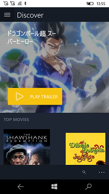
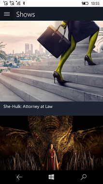
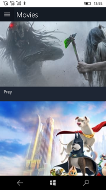
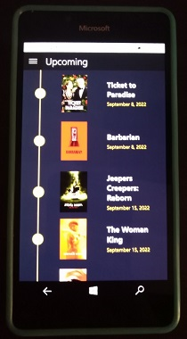

# MoviesX

This is my fork of [Xamarin Forms Movies](https://github.com/davidortinau/xamarin-forms-movies) project.

## Description

**Movies** is a Xamarin.Forms application that makes use of The Movie Database (TMDb) API, 
a popular, user editable database for movies and TV shows, to demonstrate the possibilities 
of the new backend making use of a great variety of functionality.

## Screenshots

## Xamarin.Forms : About 

[Xamarin.Forms](https://www.xamarin.com/forms) allows you to build native UIs for iOS, 
Android, Windows and macOS from a single, shared codebase. 
You can dive into mobile development with Xamarin.Forms by following our 
[free self-guided learning](https://university.xamarin.com/classes/track/self-guided) 
from Xamarin University. This project exercises the following patterns and features:

* Xamarin.Forms : How-Tos
  * [XAML UI](https://developer.xamarin.com/guides/xamarin-forms/xaml/xaml-basics/)
  * Behaviors
  * Converters
  * Custom Controls
  * [Custom Renderers](https://developer.xamarin.com/guides/xamarin-forms/custom-renderer/)
  * [Data Binding](https://developer.xamarin.com/guides/xamarin-forms/xaml/xaml-basics/data_binding_basics/)
  * IoC
  * [Messaging Center](https://developer.xamarin.com/guides/xamarin-forms/messaging-center/)
  * [MVVM](https://developer.xamarin.com/guides/xamarin-forms/xaml/xaml-basics/data_bindings_to_mvvm/)
  * [Styles](https://developer.xamarin.com/guides/xamarin-forms/user-interface/styles/)
  * Triggers
  * Dialogs
  * Navigation
  

## Requirements

* Visual Studio 2022 Community Edition is fully supported
* [The Movie DB Api Key](https://www.themoviedb.org/documentation/api)

## Setup

**Download** or clone the repository. This is a solution with two projects.

**Rebuild** the solution to get all neccesary **NuGet** packages.

Access to **AppSettings.cs** file available in the .NET Standard Library to introduce your TMDb APIs key.

Enjoy!
 

## .

Code released under the [MIT license](https://opensource.org/licenses/MIT). AS IS. No support. RnD only.

## ..

[m][e] 2022
